# HELIOS FORENSIC SUITE — COMPREHENSIVE INVESTIGATION & REPORTING GUIDE

> **Target Tool:** Helios — Data Movement Forensics CLI (`/home/ahmad/Forensics/helios`)  
> **Document Purpose:** Complete structural guide, architecture specification, pretest setup guidelines, CLI menu breakdown, scan profile workflows, and HTML evidence report explanations for generating the official Forensic Audit Report (DOCX / Markdown).

---

## TABLE OF CONTENTS
1. [Tool Overview & Core Architecture (PlantUML)](#1-tool-overview--core-architecture-plantuml)
2. [Pretest Forensic Artifact Setup & Windows GUI Simulation](#2-pretest-forensic-artifact-setup--windows-gui-simulation)
3. [Helios Interactive CLI Menu System Walkthrough](#3-helios-interactive-cli-menu-system-walkthrough)
4. [Investigation Profiles & Execution Workflows](#4-investigation-profiles--execution-workflows)
5. [HTML Forensic Report Analysis & Artifact Breakdown](#5-html-forensic-report-analysis--artifact-breakdown)
6. [Chain of Custody & Evidence Packaging](#6-chain-of-custody--evidence-packaging)

---

## 1. TOOL OVERVIEW & CORE ARCHITECTURE (PLANTUML)

Helios is a live, read-only data movement forensics suite that tracks file transfers, deletions, access history, execution events, and exfiltration patterns across local volumes and attached USB/Android devices.

### PlantUML Architecture Diagram

```plantuml
@startuml
skinparam componentStyle rectangle
skinparam backgroundColor #FFFFFF
skinparam packageBackgroundColor #F8F9FA
skinparam shadow false

title Helios Forensics Suite - High-Level Architecture

package "Evidence Sources (Live System)" {
    [Local Disks (C:, D:)] as Disks
    [Removable USB Drives] as USB
    [Windows Registry (SYSTEM, SOFTWARE)] as Registry
    [Artifact Folders (LNK, JumpLists, Prefetch, Recycle Bin)] as Artifacts
    [Windows Event Logs (.evtx)] as EVTX
}

package "Helios Core Engine" {
    [CLI / Interactive Wizard (menu.py / cli.py)] as CLI
    [Device Detector (detector.py)] as Detector
    [Profile Manager (investigation_profiles.yaml)] as ProfileMgr
    [Pipeline Coordinator (pipeline.py)] as Pipeline
    [Hasher & Live Scanner (hasher.py)] as LiveScanner
}

package "Forensic Analyzers & Adapters" {
    [USB History Analyzer] as USBAnalyzer
    [Recycle Bin Analyzer (RBCmd)] as RBAnalyzer
    [LNK & JumpList Analyzer (LECmd/JLECmd)] as LNKAnalyzer
    [Prefetch Analyzer (PECmd)] as PrefetchAnalyzer
    [Event Log Analyzer (Chainsaw/Sigma)] as EVTXAnalyzer
    [ShellBags Analyzer (SBECmd)] as SBAnalyzer
    [FileType Verifier & ExifTool] as FileVerifier
    [Suspicious Detector (Rule Engine)] as SuspiciousDetector
    [SleuthKit Adapter (fls / fsstat)] as SleuthKit
}

package "Correlation & Synthesis Engine" {
    [Cross-Device Correlator (correlator.py)] as Correlator
    [Snapshot Engine (snapshot.py)] as Snapshot
    [Keyword Search Engine (keyword_search.py)] as KeywordEngine
}

package "Report & Evidence Delivery" {
    [Report Generator (Jinja2 Templates)] as ReportGen
    [ApexCharts Integration] as Charts
    [HTML Forensic Report (.html)] as HTMLReport
    [CSV / JSON Bundles] as DataExports
    [Evidence ZIP Package] as EvidenceZip
}

' Relations
Disks --> Detector
USB --> Detector
Registry --> USBAnalyzer
Artifacts --> RBAnalyzer
Artifacts --> LNKAnalyzer
Artifacts --> PrefetchAnalyzer
Artifacts --> SBAnalyzer
EVTX --> EVTXAnalyzer
Disks --> LiveScanner
Disks --> SleuthKit

CLI --> Detector
CLI --> ProfileMgr
CLI --> Pipeline

Pipeline --> LiveScanner
Pipeline --> USBAnalyzer
Pipeline --> RBAnalyzer
Pipeline --> LNKAnalyzer
Pipeline --> PrefetchAnalyzer
Pipeline --> EVTXAnalyzer
Pipeline --> SBAnalyzer
Pipeline --> FileVerifier
Pipeline --> SuspiciousDetector
Pipeline --> SleuthKit

LiveScanner --> Correlator
USBAnalyzer --> Correlator
LNKAnalyzer --> Correlator
SleuthKit --> Correlator

Correlator --> ReportGen
Snapshot --> ReportGen
KeywordEngine --> ReportGen

ReportGen --> Charts
ReportGen --> HTMLReport
ReportGen --> DataExports
ReportGen --> EvidenceZip

@enduml
```



---

## 2. PRETEST FORENSIC ARTIFACT SETUP & WINDOWS GUI SIMULATION

To simulate an insider threat / data exfiltration scenario prior to running Helios, create specific artifacts on the target system.

### Pretest Condition 1: Shift+Delete File Removal
* **Objective:** Test SleuthKit raw disk parsing vs Recycle Bin `$I` parsing.
* **Actions:**
  1. Open Windows File Explorer in `C:\Users\TargetUser\Documents\Sensitive_Docs\`.
  2. Select confidential files: `Q3_Financial_Projections.xlsx`, `Passwords_Backup.txt`.
  3. Hold `Shift` and press `Delete` (bypassing Recycle Bin).
  4. Confirm permanent deletion prompt in Windows GUI.
* **Forensic Significance:** Does not generate an `$I` file in `$Recycle.Bin`. Can only be recovered by raw disk inspection (`fls` / MFT enumeration).

### Pretest Condition 2: Double File Extension Masquerading
* **Objective:** Test `RULE-002` (Double File Extensions) and Magic Byte verification (`exiftool`).
* **Actions:**
  1. Create an executable or script payload (e.g. `exfil_payload.exe` or `stealer.bat`).
  2. Rename file to `Quarterly_Audit_Report.pdf.exe` or `Invoice_Details.docx.bat`.
  3. Ensure File Name Extensions are enabled in Windows Explorer (`View -> Show -> File name extensions`).
* **Forensic Significance:** Triggers `CRITICAL` alert for extension masquerading.

### Pretest Condition 3: Large Archive in Temp Folder
* **Objective:** Test `RULE-005` (Large Archive Files in Temp).
* **Actions:**
  1. Compress multiple confidential data folders into a ZIP file exceeding 100 MB (e.g., `Staged_Exfil_Data.zip`).
  2. Save to `C:\Users\TargetUser\AppData\Local\Temp\` or `C:\Windows\Temp\`.
* **Forensic Significance:** Triggers `HIGH` severity alert for data staging in temporary space prior to exfiltration.

### Pretest Condition 4: Executables on Removable Media (USB)
* **Objective:** Test `RULE-001` (Executable Files on Removable Drives).
* **Actions:**
  1. Plug in USB storage drive labeled `E:` (or `F:`).
  2. Copy executable files (`process_dump.exe`, `mimikatz.exe`, `script.ps1`) to root of USB.
* **Forensic Significance:** Triggers `HIGH` severity alert for unauthorized binaries on USB devices.

### Pretest Condition 5: Extension Mismatch / Spoofing
* **Objective:** Test `RULE-009` (File Extension Mismatch) via ExifTool / Magic Bytes.
* **Actions:**
  1. Take a PNG image file (`confidential_blueprint.png`).
  2. Rename file extension to `confidential_blueprint.txt` or `confidential_blueprint.doc`.
* **Forensic Significance:** Magic bytes (`89 50 4E 47`) mismatch the declared extension, triggering an alert.

---

### Screenshot Generation Methodology for Windows GUI & HTML Sections

To capture high-fidelity screenshots for the report:

#### A. Generating Windows GUI Pretest Screenshots (Creating Files, Shift+Delete, Extensions)
1. **Method 1: Native Windows Screenshot Capture (`Win + Shift + S` or `PrtScn`)**
   - **Shift+Delete Dialog Capture:** Open File Explorer to `C:\Users\TargetUser\Documents\Sensitive_Docs\`, select `Q3_Financial_Projections.xlsx`, press `Shift + Delete`. Capture the modal pop-up reading: *"Are you sure you want to permanently delete this file?"*.
   - **Double Extension File Creation:** Enable file extensions in Explorer (`View -> Show -> File name extensions`). Right-click $\rightarrow$ Rename file to `Invoice_2026.pdf.exe`. Capture the file entry showing the `.pdf.exe` filename alongside the "Application" file type column.
   - **USB Drive Staging:** Open `E:\` (USB Removable Disk). Capture the file listing showing `process_dump.exe`, `exfil_payload.bat`, and `Staged_Exfil_Data.zip`.

2. **Method 2: AI Image Generation Prompts (`generate_image` tool)**
   - **Prompt for Shift+Delete:**  
     `"A realistic clean Windows 11 desktop screenshot showing File Explorer open to C:\\Documents\\Sensitive_Docs. A file named 'Q3_Financial_Projections.xlsx' is selected. A Windows prompt box is open in the center displaying: 'Are you sure you want to permanently delete this file? Yes / No buttons'."`
   - **Prompt for Double Extension:**  
     `"A Windows 11 File Explorer screenshot with dark mode theme. Shows a list of files including 'Invoice_2026.pdf.exe' with file type column showing 'Application' and size '2.4 MB'."`

#### B. Capturing HTML Forensic Report Sections & Components
When explaining specific sections of the generated HTML report (e.g., Executive Summary, Alerts Table, Data Movement Hops, SleuthKit Deleted Files):

1. **DOM Element Headless Screenshot (Playwright / Puppeteer / Selenium)**
   - Render the generated HTML report file (`helios_report_Case-001_exfiltration.html`) in a browser engine.
   - Capture specific element selectors or bounding boxes:
     - Executive Metrics: `page.locator(".metric-row").screenshot(path="metric_cards.png")`
     - Data Movement Table: `page.locator("#sec-transfers").screenshot(path="transfers_table.png")`
     - Security Alerts: `page.locator("#sec-alerts").screenshot(path="alerts_table.png")`
     - SleuthKit Deleted Files: `page.locator("#sec-deletions").screenshot(path="deletions_table.png")`

2. **Browser Developer Tools Inspection Capture**
   - Open report in Chrome / Edge.
   - Open Developer Tools (`F12`), select element (e.g., `<div id="filetypeChart">`), press `Ctrl + Shift + P`, type `Capture node screenshot`.


---

## 3. HELIOS INTERACTIVE CLI MENU SYSTEM WALKTHROUGH

Helios features a terminal UI built with Rich. Below are the exact menus, options, and screen layouts.

### Main Engine Menu (`helios menu`)

```
================================================================================
                           HELIOS FORENSICS SUITE                              
                         Data Movement & Investigation                         
             [Press [0] at any prompt to exit or [B] to go back]               
================================================================================
┌────────────────────── Primary Operations Menu ───────────────────────────────┐
│                                                                              │
│    [1]  New Investigation            [5]  Keyword Search                     │
│    [2]  Drives & Devices             [6]  Export Report                      │
│    [3]  Quick USB Scan               [7]  Settings & Tools                   │
│    [4]  Snapshot Manager             [0]  Exit Helios                        │
│                                                                              │
└──────────────────────────────────────────────────────────────────────────────┘
Helios Main Engine [1/2/3/4/5/6/7/0] >
```

---

### Sub-Menu 1: New Investigation Guided Wizard (`[1]`)
* **Step 1: Case Identifiers:**
  * Prompt: `Case Name / Reference ID` (Default: `Case-YYYYMMDD-HHMM`)
  * Prompt: `Investigator Name` (Default: System User)
* **Step 2: Target Volume & Device Detection:**
  * Displays mounted local drives (Drive Letter, Label, Filesystem, Size, Free Space, Type).
  * Displays connected Android devices via ADB bridge.
  * Options: `[1..N]` Select target drives, `[A]` Select All, `[B]` Back.
* **Step 3: Investigation Profile Selection:**
  * `[1]` **Exfiltration Focus:** USB history, deletions, LNK/JumpLists, hash matching, suspicious files, deleted-file recovery.
  * `[2]` **Employee Exit Scan:** USB history, deletions, LNK/JumpLists, ShellBags, suspicious files, hash matching.
  * `[3]` **Incident Response:** Prefetch execution, event logs, ShellBags, suspicious files, deletions.
  * `[4]` **Full System Forensics:** All modules enabled.
* **Step 4: Optional Date Range Filter:**
  * Prompt: `Start Date (YYYY-MM-DD)`
  * Prompt: `End Date (YYYY-MM-DD)`
* **Step 5: Pre-Flight Summary & Execution:**
  * Shows Case Parameters, Target Drives, Selected Profile, and progress bar during live pipeline execution.

---

### Sub-Menu 2: Drives & Devices Inspector (`[2]`)
* Displays active device table:
  * **Device ID / Name:** Local Host PC, Attached USB Drive, Connected Android Device.
  * **Type:** PC, USB, ANDROID.
  * **Serial / Volume:** Device Serial Number, Volume Serial.
  * **Mount Path:** `C:\`, `E:\`, ADB Serial.
  * **Storage Capacity:** Size in GB, Filesystem (`NTFS`, `FAT32`, `exFAT`).
* Options: `[R]` Refresh Connected Devices & Drives, `[B]` Back.

---

### Sub-Menu 3: Quick USB Activity Scan (`[3]`)
* Rapid targeted forensic scan focusing on USB connection history and file copies.
* **Capabilities:**
  1. Windows Registry `USBSTOR` connection timestamps & serial numbers.
  2. Windows `SetupAPI.dev.log` for first-connection timestamps.
  3. File creation & modification events on attached USB media.
* Options: `[1]` Complete USB Scan (Registry + Mounted), `[2]` Registry USB History Only, `[3]` Mounted USB Drive Only, `[B]` Back.

---

### Sub-Menu 4: Filesystem Snapshot Manager (`[4]`)
* Point-in-time cryptographic filesystem snapshot creation and comparison engine.
* **Option 1 — Create Snapshot:** Hashes files on a selected path/drive and saves `.json` snapshot file to `./snapshots/`.
* **Option 2 — Compare Two Snapshots (Diff Analysis):**
  * Select Baseline Snapshot `#1` and Comparison Snapshot `#2`.
  * Outputs summary of:
    * **Added Files:** New files created after baseline.
    * **Deleted Files:** Files missing in secondary snapshot.
    * **Modified Files:** Files with changed SHA-256 hash or modification timestamp.
    * **Renamed Files:** Matched SHA-256 hash with changed file path/name.

---

### Sub-Menu 5: Keyword & Pattern Search (`[5]`)
* Cross-device keyword search across file names and raw file content.
* **Built-in Presets:**
  * `[1]` Credentials & Passwords (`password`, `passwd`, `login`, `credential`)
  * `[2]` Financial Data (`bank`, `transfer`, `invoice`, `payment`, `salary`)
  * `[3]` Confidential Documents (`confidential`, `secret`, `internal`, `private`)
  * `[4]` Personal Identifiers (`ssn`, `passport`, `aadhaar`, `credit card`)
  * `[5]` Custom Keyword (Manual string or Regex search)
* Outputs hit table and generates dedicated HTML report + `helios_keyword_search_<timestamp>.json` hit package.

---

### Sub-Menu 6: Export Report & Evidence Package (`[6]`)
* Export formats:
  * `[1]` **Corporate HTML Dashboard:** Self-contained single-file HTML report (`helios_executive_report.html`) with ApexCharts.
  * `[2]` **JSON Structured Package:** `helios_investigation.json` containing raw structures.
  * `[3]` **Evidence CSV Spreadsheet Bundle:** `events.csv`, `alerts.csv`, `file_records.csv`.
  * `[4]` **Evidence ZIP Package:** Bundles the HTML report, case JSON and CSVs into `helios_evidence_package.zip`.

---

### Sub-Menu 7: Settings & Tool Diagnostics (`[7]`)
* Diagnostic table showing status of bundled forensic tools:

| Tool / Adapter | Component / Module | Expected Binary | Status |
| --- | --- | --- | --- |
| SleuthKit | `SleuthKitAdapter` | `fls.exe`, `fsstat.exe` | ACTIVE |
| EZ Tools - LECmd | `LnkJumpListAnalyzer` | `LECmd.exe` | ACTIVE |
| EZ Tools - JLECmd | `LnkJumpListAnalyzer` | `JLECmd.exe` | ACTIVE |
| EZ Tools - RBCmd | `RecycleBinAnalyzer` | `RBCmd.exe` | ACTIVE |
| EZ Tools - PECmd | `PrefetchAnalyzer` | `PECmd.exe` | ACTIVE |
| EZ Tools - SBECmd | `ShellBagsAnalyzer` | `SBECmd.exe` | ACTIVE |
| Chainsaw & Sigma | `EventLogsAnalyzer` | `chainsaw.exe` | ACTIVE |
| EZ Tools - MFTECmd | `MFTAnalyzer` / `USNJournalAnalyzer` | `MFTECmd.exe` | ACTIVE |
| ExifTool | `FileTypeVerifier` | `exiftool.exe` | ACTIVE |
| Android Debug Bridge | `ADBAdapter` | `adb.exe` | ACTIVE |
| Python Registry | `UsbHistoryAnalyzer` | `python-registry` | ACTIVE |
| Python EVTX | `EventLogsAnalyzer` | `python-evtx` | ACTIVE |

---

## 4. INVESTIGATION PROFILES & EXECUTION WORKFLOWS

Helios utilizes 4 distinct investigation profiles. Each profile controls which analyzers execute, preventing unnecessary overhead and generating tailored HTML report templates.

```
                  ┌─────────────────────────────────────────┐
                  │       Helios Profile Controller         │
                  └────────────────────┬────────────────────┘
                                       │
      ┌────────────────────┬───────────┴───────────┬────────────────────┐
      ▼                    ▼                       ▼                    ▼
┌─────────────┐   ┌─────────────────┐    ┌──────────────────┐   ┌──────────────┐
│Exfiltration │   │  Employee Exit  │    │Incident Response │   │ Full System  │
│  Profile    │   │     Profile     │    │     Profile      │   │   Profile    │
└──────┬──────┘   └────────┬────────┘    └────────┬─────────┘   └──────┬───────┘
       │                   │                      │                    │
       ├─ USB History      ├─ USB History         ├─ Prefetch Exec     ├─ ALL MODULES
       ├─ Deletions        ├─ Deletions           ├─ Event Logs        │  ENABLED
       ├─ LNK / JumpList   ├─ LNK / JumpList      ├─ ShellBags         │
       ├─ Hash Match       ├─ ShellBags           ├─ Suspicious Files  │
       ├─ Suspicious Files ├─ Suspicious Files    ├─ Deletions         │
       └─ SleuthKit Recov  └─ SleuthKit Recov     └─ SleuthKit Recov   │
```

### Module Gating Matrix

| Forensic Module Key | Exfiltration Profile | Employee Exit Profile | Incident Response Profile | Full System Profile |
| --- | :---: | :---: | :---: | :---: |
| `usb_transfers` | **ENABLED** | **ENABLED** | Disabled | **ENABLED** |
| `file_deletions` | **ENABLED** | **ENABLED** | **ENABLED** | **ENABLED** |
| `recent_file_access` | **ENABLED** | **ENABLED** | Disabled | **ENABLED** |
| `cross_device_matching`| **ENABLED** | **ENABLED** | Disabled | **ENABLED** |
| `suspicious_files` | **ENABLED** | **ENABLED** | **ENABLED** | **ENABLED** |
| `deleted_file_recovery`| **ENABLED** | **ENABLED** | **ENABLED** | **ENABLED** |
| `shellbags` | Disabled | **ENABLED** | **ENABLED** | **ENABLED** |
| `program_execution` | Disabled | Disabled | **ENABLED** | **ENABLED** |
| `event_logs` | Disabled | Disabled | **ENABLED** | **ENABLED** |
| `mft_analysis` (MFTECmd) | Disabled | **ENABLED** | **ENABLED** | **ENABLED** |
| `usn_journal` (MFTECmd) | Disabled | **ENABLED** | **ENABLED** | **ENABLED** |

Each module in the report's "Investigation Profile & Module Execution" card carries one of four honest statuses: **ran**, **skipped** (artifact type absent from the scanned volume — not an error), **failed** (error, detail shown), or **disabled** (not part of the selected profile). Nothing is fabricated.

---

## 5. HTML FORENSIC REPORT ANALYSIS & ARTIFACT BREAKDOWN

Helios generates standalone HTML reports rendered via Jinja2 templates (`src/helios/reporting/templates/`). Each report includes interactive metric cards, ApexCharts visualizations, filtered data tables, evidence artifact paths, and chain of custody logs.

### 5.1 Report Layout & Navigation Structure
* **Top Header Bar:** Shows Case Reference ID, Lead Analyst Name, Report Generation Timestamp, and Profile Badge.
* **Interactive Navigation Tabs:**
  1. `Summary`: Executive dashboard, metric cards, charts, top alerts, scanned drives table, module execution summary.
  2. `Data Movement` (Exfiltration / Exit / Full profiles): Transfer correlation chains, exfiltration paths, deleted files table (Recycle Bin + SleuthKit recovery).
  3. `Timeline / Events`: Chronological master event log with event type filters (`USB_CONNECT`, `FILE_MOVE`, `FILE_DELETE`, `APP_EXECUTE`).
  4. `Alerts`: Security alerts sorted by severity (`CRITICAL`, `HIGH`, `MEDIUM`, `LOW`) with exact artifact paths.
  5. `Evidence`: Hashes, export paths, chain of custody log.

---

### 5.2 Breakdown of HTML Report Sections & Findings

#### A. Executive Summary & Metric Cards
* **Files Indexed:** Total files cataloged during filesystem walk.
* **Forensic Events:** Total parsed timeline events across all enabled modules.
* **Alerts Raised:** Highlighting critical/high security rule violations.
* **Deleted Files:** Counts entries found in `$Recycle.Bin` plus unallocated raw disk space via SleuthKit `fls`.
* **File Transfers / Hops:** Matched hash occurrences across local drive and USB drive.

#### B. Charts & Visualizations
* **File Types Distribution Chart (Donut):** Shows proportion of Executables, Archives, Documents, Images, Scripts, and Unclassified files.
* **Data Flow Between Devices Chart (Sankey / Bar):** Visualizes movement from `Local Workstation` to `USB Removable Storage`.
* **Deletions by Day / Timeline Chart:** Timeline histogram of file deletion spikes (useful for identifying mass-deletion events).

#### C. Data Movement & Cross-Device Correlation Table
* **Movement Chain:** Matches exact SHA-256 hashes across devices.
* **Example Finding:**
  * **File Name:** `Q3_Financial_Master.xlsx`
  * **SHA-256:** `a8f5f167f44f4964e6c998dee827110c...`
  * **Source Path:** `C:\Users\Target\Documents\Q3_Financial_Master.xlsx` (Created: `2026-08-01 10:15:00`)
  * **Destination Path:** `E:\Exfil_Folder\Q3_Financial_Master.xlsx` (Copied: `2026-08-01 14:22:10`)
  * **Status:** `EXFILTRATED TO REMOVABLE MEDIA`

#### D. Deleted Files Section (Recycle Bin vs SleuthKit Raw Recovery)
* **Recycle Bin Parsing (`$I` Files via RBCmd):**
  * Displays original file path, file size, deletion timestamp, and user SID.
  * *Limitation Note in Report:* Files deleted via `Shift+Delete` or emptied Recycle Bin bypass `$I` file creation.
* **SleuthKit `fls` Recovery:**
  * Lists deleted MFT records, inode allocations, and orphaned entries (`$OrphanFiles`).
  * Identifies files deleted directly via `Shift+Delete` without Recycle Bin records.

#### E. Security Alerts & Heuristics Breakdown
* **Double Extensions (`RULE-002`):** Identifies files such as `Invoice_2026.pdf.exe`. Shows exact path and risk score.
* **Executable on USB (`RULE-001`):** Flags `.exe`/`.ps1`/`.bat` binaries residing on drive `E:\`.
* **Large Archive in Temp (`RULE-005`):** Identifies staged `.zip` archives >100MB in `%TEMP%`.
* **Extension Mismatch (`RULE-009`):** Reports files where ExifTool magic byte detection differs from file extension (e.g. PNG image named `.txt`).

#### F. USB Connection History Table
* Combines `USBSTOR` registry keys, `MountPoints2`, `SetupAPI.dev.log`, and LNK shortcuts to list:
  * Device Name & Vendor ID / Product ID.
  * Serial Number.
  * First Connected Timestamp.
  * Last Connected Timestamp.
  * Assigned Drive Letter (`E:`).

---

## 6. CHAIN OF CUSTODY & EVIDENCE PACKAGING

Every investigation execution generates a timestamped chain of custody record written to both the HTML report and `chain_of_custody.json`.

### Sample Chain of Custody Log Entry

```json
[
  {
    "timestamp": "2026-08-04T22:15:00.123456",
    "action": "Case Initialization & Target Drive Selection",
    "target": "C:\\, E:\\",
    "result": "Scanned 1799 active files and 1809 timeline events",
    "tool_name": "Helios Forensic Engine v0.1.0"
  },
  {
    "timestamp": "2026-08-04T22:15:05.654321",
    "action": "Cryptographic Hashing & SHA-256 Digest Verification",
    "target": "1799 files on drives C:, E:",
    "result": "SHA-256 digests generated and stored in evidence manifest",
    "tool_name": "helios.core.hasher (SHA-256)"
  },
  {
    "timestamp": "2026-08-04T22:15:12.987654",
    "action": "Investigation Profile 'exfiltration' — Module Execution",
    "target": "6/9 modules executed",
    "result": "USB History Analyzer: ran; Recycle Bin Analyzer: ran; LNK & JumpLists Analyzer: ran; SleuthKit Recovery: ran",
    "tool_name": "ProfileManager"
  },
  {
    "timestamp": "2026-08-04T22:15:18.456789",
    "action": "Cross-Device Correlation & Data Movement Graph Generation",
    "target": "Case: Case-20260804-0120",
    "result": "Correlated 1809 events, 78 movement chains built",
    "tool_name": "CrossDeviceCorrelator"
  }
]
```

### Evidence Output Artifact Bundle (`./reports/` & `./exports/`)

When exporting an investigation via Sub-menu `[6]`, the following files are produced:

1. **`helios_executive_report.html`** (`[1]`) / **`helios_report.html`** (`[4]`) — Self-contained HTML report.
2. **`helios_investigation.json`** (`[2]`) / **`helios_case.json`** (`[4]`) — Complete serialized investigation data model.
3. **`events.csv`** — All timeline events (Create, Modify, Delete, Move, USB, Execution).
4. **`alerts.csv`** — All security rule alerts with artifact file paths.
5. **`file_records.csv`** — Complete file inventory with SHA-256 hashes.
6. **`helios_evidence_package.zip`** (`[4]`) — Compressed evidence bundle of the above artifacts.

Live investigations run through the pipeline write their own bundle next to each report in
`reports/<case>/exports/`: `investigation.json`, `events_full.json`, `events.csv`,
`alerts.csv` and `file_records.csv`.

---

> **End of Guide** — This document contains all structural, architectural, CLI menu, profile, and artifact information required to generate the official Forensic Audit Report.
